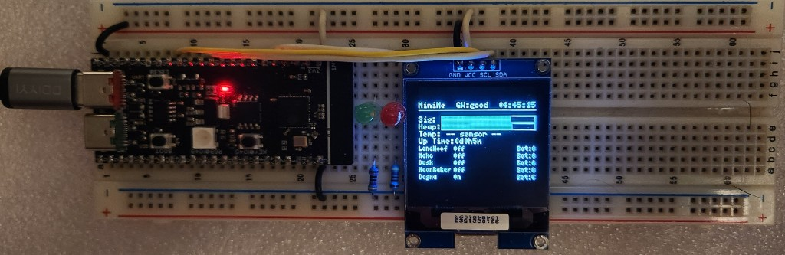

# MiniMe — a Discord bot on ESP32-S3

MiniMe is firmware for a **WeAct Studio ESP32-S3-N16R8** that runs a Discord bot on the chip. It joins Wi‑Fi and the Discord Gateway, reads sensors, drives GPIO from chat, and shows a live dashboard on a **128×128 SSD1327** OLED.



*Breadboard prototype: WeAct Studio ESP32-S3-N16R8, 128×128 SSD1327 (GND / VCC / SCL / SDA), and two discrete LEDs.*

Current version: see `VERSION` and `CHANGELOG.md`.

---

## What this bot can do

Same list Discord shows for `!help`:

**Public commands** (DMs, `TARGET_CHANNEL_ID`, or `TARGET_CHANNEL_ID1`):

- `!apod` — NASA Astronomy Picture of the Day
- `!ask <question>` — DeepSeek text reply in chat
- `!display <text>` — writes payload text on OLED rows 15–16 (not the `!display` word)
- `!help` — this command list
- `!iss` — International Space Station position
- `!news` — space / high-tech headlines
- `!physics` — latest arXiv physics papers
- `!sysinfo` — uptime, free heap (internal + 8MB PSRAM), Wi‑Fi RSSI, gateway
- `!temp` — indoor DS18B20 temperature
- `!time` — bot local time (US Pacific, DST aware)
- `!weather <zip>` — US ZIP weather (OpenWeatherMap)

**Owner-only** (`OWNER_ID_STR`):

- `!led on` / `!led off` — onboard RGB NeoPixel
- `!servo <0-90>` — servo angle (updates the `Srv:` bar)
- `!set1 on` / `!set1 off` — digital output pin 1
- `!set2 on` / `!set2 off` — digital output pin 2

### Automatic posts

Sent to `TARGET_CHANNEL_ID` (no command needed):

- Every **4 hours:** system diagnostics
- Daily at **6:00, 12:00, and 18:00** (Pacific): indoor temperature summary

### `!ask` / DeepSeek

- Request `max_tokens`: **900**
- JSON parse buffer: **12288** bytes
- Discord post cap: **3600** characters
- HTTPS on the ESP32 can take several seconds

---

## OLED dashboard

The display is a **128×128 SSD1327** grayscale OLED, driven with U8g2 (`U8G2_SSD1327_WS_128X128_F_HW_I2C`). Do not use the EastRising `EA_W128128` constructor on this panel; it shifts the picture so the top of the buffer is not the top of the glass.

Font is **5×7** with 1px padding (**8px** per row). U8g2 `drawStr(x, y)` uses **`y` as the font baseline** (no `setCursor`). Header `y=7` is the top of the panel (pixels ~0–6).

| Row | Baseline y | What it shows |
|---|---|---|
| 0 | 7 | `MiniMe`, `GW:Good` / `GW:Bad`, right-justified `HH:MM:SS` |
| 2 | 15 | `Sig:` Wi‑Fi RSSI bar |
| 3 | 23 | `Heap:` free memory bar (internal SRAM + 8MB PSRAM) |
| 4 | 31 | `Srv:` servo position bar, **0–90°** (boot commands **45°**, half fill) |
| 5 | 39 | `Temp:` DS18B20, or `-- sensor --` if missing |
| 6 | 47 | `Up Time:` days / hours / minutes |
| 7–14 | 55 + row×8 … 111 | Eight user rows: name, `On` / `Idle` / `DND` / `Off`, `Bot:N` (commands in the last 24 hours) |
| 15–16 | 119 / 127 | Command / action text, or `!display` payload. **Blank when idle** |

Empty user slots show `---`. Names come from a startup REST member fetch (nick → global name → username), up to **eight** members. Presence updates from the Gateway. Command counts reset every 24 hours.

Commands and gateway events **do not wipe** the dashboard. They write **rows 15 and 16** only, then those rows clear when the message expires.

### `!display`

- Public command.
- Only the text after `!display` is shown (the command word is not drawn).
- Cap **50** characters: **25** on row 15, **25** on row 16.
- Stays **6 seconds**. A new `!display` overwrites and restarts the 6-second timer.

### Display sleep

After **10 minutes** with no real events, the panel turns **off** (`u8g2.setPowerSave(1)`). That is OLED power-save only. The microcontroller, Wi-Fi, and Discord Gateway keep running.

These **do not** reset the timer: signal / heap / servo bars, clock, uptime, and the 2-second dashboard refresh.

These **wake** the panel and restart the 10-minute timer: Discord commands, presence status changes, gateway connect/disconnect, `!display`, scheduled reports, and other status lines on rows 15–16.

---

## Fill in these values

```cpp
const char* WIFI_SSID     = "ssid";
const char* WIFI_PASSWORD = "password";
const char* BOT_TOKEN     = "bot token";
const char* WEATHER_API_KEY = "WEATHER_API_KEY";
const char* NASA_API_KEY    = "NASA_API_KEY";
const char* DEEPSEEK_API_KEY = "DEEPSEEK_API_KEY";
#define BOT_GUILD_ID "GUILD_ID"
const String OWNER_ID_STR        = "OWNER_ID_STR";
const char*  TEMP_CHANNEL_ID_STR = "TEMP_CHANNEL_ID_STR";
const String TARGET_CHANNEL_ID  = "TARGET_CHANNEL_ID";
const String TARGET_CHANNEL_ID1 = "TARGET_CHANNEL_ID1";
```

| Field | Used for |
|---|---|
| `WIFI_SSID` / `WIFI_PASSWORD` | ESP32 station Wi‑Fi |
| `BOT_TOKEN` | Discord Gateway + REST |
| `WEATHER_API_KEY` | OpenWeatherMap `!weather` |
| `NASA_API_KEY` | NASA APOD for `!apod` |
| `DEEPSEEK_API_KEY` | DeepSeek for `!ask` |
| `BOT_GUILD_ID` | Guild used at boot to load up to 8 members (numeric snowflake) |
| `OWNER_ID_STR` | Who can run LED / set1 / set2 / servo |
| `TARGET_CHANNEL_ID` | Commands + auto sysinfo / scheduled summaries |
| `TARGET_CHANNEL_ID1` | Second channel where commands are allowed |
| `TEMP_CHANNEL_ID_STR` | Reserved / unused by commands |

IDs are **digits only**. Paste them as C strings, for example `"123456789012345678"`.

If `BOT_GUILD_ID` is still the placeholder, boot tries to resolve the guild from `TARGET_CHANNEL_ID`.

---

## How to get a Discord bot token (`BOT_TOKEN`)

1. Open [Discord Developer Portal](https://discord.com/developers/applications) and sign in.
2. **New Application** → name it (for example MiniMe) → Create.
3. Left sidebar: **Bot**.
4. If there is no bot yet, click **Add Bot**.
5. Under **Token**, click **Reset Token** / **Copy**. That string is `BOT_TOKEN`.
6. Treat it like a password. Anyone with it can control the bot.
7. Enable these **Privileged Gateway Intents** (this firmware uses them):
   - **Message Content Intent**
   - **Server Members Intent**
   - **Presence Intent**
8. Identify intents value in firmware: `37635` (guilds, members, presences, guild messages, DMs, message content). `large_threshold` is `250`.

### Invite the bot to your server

1. Developer Portal → your app → **OAuth2** → **URL Generator**.
2. Scopes: `bot`.
3. Bot permissions (minimum):
   - View Channels
   - Send Messages
   - Read Message History
4. Copy the generated URL, open it in a browser, pick your server, authorize.
5. In Discord, the bot stays offline until the ESP32 connects.

---

## How to get your owner ID (`OWNER_ID_STR`)

This is **your Discord user ID**, not the bot’s ID.

1. Discord: **User Settings** → **Advanced** → enable **Developer Mode**.
2. Right-click **your own avatar** → **Copy User ID**.
3. Paste that into `OWNER_ID_STR`.

If owner commands never work, you copied a channel ID or the application ID by mistake.

---

## How to get channel and guild IDs

Developer Mode must be on.

- **Channel:** right-click the text channel → **Copy Channel ID**. Use one for `TARGET_CHANNEL_ID` (auto reports) and optionally another for `TARGET_CHANNEL_ID1`.
- **Guild / server:** right-click the server icon → **Copy Server ID**. That is `BOT_GUILD_ID`.

The bot must be able to **see and send** in those channels.

---

## How to get an OpenWeatherMap key (`WEATHER_API_KEY`)

1. Create a free account at [OpenWeatherMap](https://home.openweathermap.org/users/sign_up).
2. Sign in → [API keys](https://home.openweathermap.org/api_keys).
3. Copy the default key, or generate one.
4. Paste it into `WEATHER_API_KEY` with **no extra spaces**.
5. New keys can take up to a few hours to activate.
6. `!weather` uses Current Weather Data with `zip={zip},US` and `units=imperial`.

---

## Science / physics commands

These are public. Digests are short so the ESP32 stays within memory limits.

| Command | Source | Key? |
|---|---|---|
| `!news` | [Spaceflight News API](https://api.spaceflightnewsapi.net/) — 3 space / high-tech headlines | No |
| `!physics` | [arXiv](https://arxiv.org/) `cat:physics` — 3 newest papers | No |
| `!apod` | [NASA APOD](https://api.nasa.gov/) — title, short explanation, image URL | Yes |
| `!iss` | [Open Notify](http://open-notify.org/) — ISS latitude / longitude | No |

### How to get a NASA key (`NASA_API_KEY`)

1. Open [api.nasa.gov](https://api.nasa.gov/) and generate a free key (email signup).
2. Paste it into `NASA_API_KEY`.
3. NASA’s `DEMO_KEY` works for light testing but is shared and rate-limited. Use your own key if `!apod` starts failing.

---

## How to get a DeepSeek key (`DEEPSEEK_API_KEY`)

1. Create an account at [DeepSeek Platform](https://platform.deepseek.com/).
2. Open [API Keys](https://platform.deepseek.com/api_keys).
3. Create a key and copy it.
4. Paste it into `DEEPSEEK_API_KEY`.
5. In Discord: `!ask what is quantum entanglement?`
6. Replies can be longer now (`max_tokens` 900, post cap 3600 characters). HTTPS on the ESP32 can take several seconds.

---

## Hardware (default pins)

This board: **WeAct Studio ESP32-S3-N16R8** (**16MB flash**, **8MB PSRAM**).

Display: **SSD1327**, **128×128** pixels, I2C.

| Device | GPIO |
|---|---|
| RGB NeoPixel | 48 |
| Servo | 47 |
| Digital out 1 (`!set1`) | 6 |
| Digital out 2 (`!set2`) | 7 |
| DS18B20 data | 10 |
| OLED SSD1327 (128×128) SDA | 8 |
| OLED SSD1327 (128×128) SCL | 9 |

OLED module labels: **GND, VCC, SCL, SDA**. The panel is **128×128**. Change pins in the sketch if your wiring differs.

---

## Arduino IDE setup

1. Install [Arduino IDE](https://www.arduino.cc/en/software) and the **esp32** board package (Espressif).
2. Board: **ESP32-S3**. This hardware is a **WeAct Studio ESP32-S3-N16R8** (N16 = 16MB flash, R8 = 8MB PSRAM).
3. Tools: enable **OPI PSRAM** (8MB) and a **16MB** flash partition scheme that matches the N16R8.
4. Libraries (Library Manager):
   - WebSockets (by Markus Sattler)
   - ArduinoJson
   - U8g2
   - OneWire
   - DallasTemperature
   - Adafruit NeoPixel
   - NTPClient
5. Open `MiniMe_Discord_Bot/MiniMe_Discord_Bot.ino`.
6. Fill in Wi‑Fi, token, keys, and IDs.
7. Upload. Serial monitor **115200**: look for PSRAM size, `[GW] CONNECTED`, and `[GW] IDENTIFY sent`.
8. In Discord, try `!help`.

Do not enable `heap_caps_malloc_extmem_enable` for small allocations. Wi‑Fi / TLS in PSRAM can crash this board. Gateway JSON (`256KB`) is allocated in PSRAM on purpose.

---

## Safety

- Never commit a sketch that contains a live bot token, API key, password, or Discord snowflake ID.
- If a token leaks, reset it in the Developer Portal immediately.
